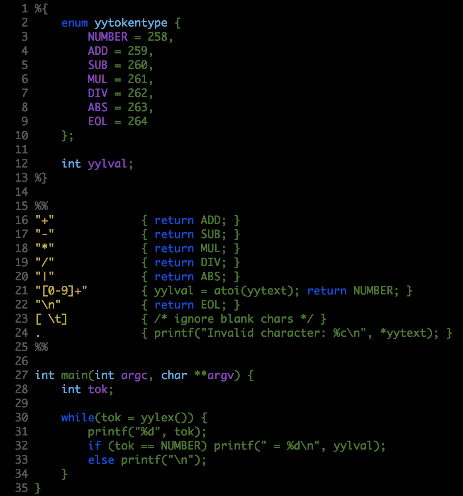

### What's this?
It's a mode for flex files that provide better syntax highlight than flex-mode.el

## Installation
Then put flex.el to your load-path.

The load-path is usually ~/elisp/.

It's set in your ~/.emacs like this:

```Elisp
(add-to-list 'load-path "<path-to-flex") ; add flex to your load-path
(require 'flex)

(add-to-list 'auto-mode-alist '("\\.l$" . flex-mode))
(autoload 'flex-mode "flex")
```
